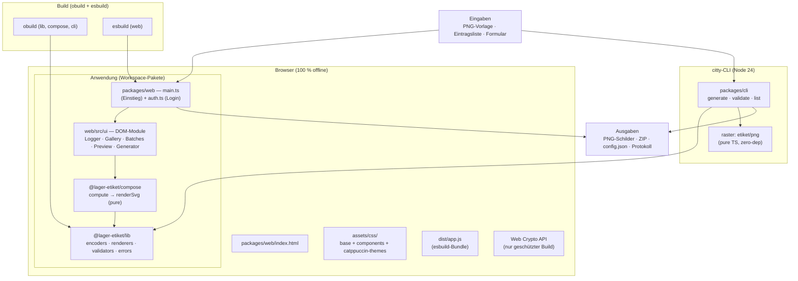
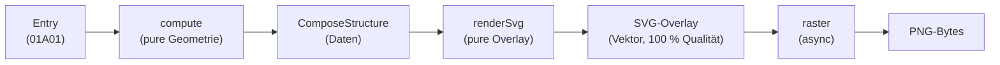

Dieses Dokument beschreibt die Architektur des Projekts nach der etiket-Umstellung: pnpm Workspaces, flache Paketstruktur, Pure-Functions-Pipeline, Rasterung via `etiket/png`.

<Info>
  Historische Analysen und Vergleiche: `docs/ANALYSE-MIGRATION-UND-VERGLEICHE.md`. Entscheidungen: `docs/decisions/` (ADRs 0001–0007). Status: [Roadmap](/entwicklung/roadmap).
</Info>

## 1. Systemübersicht



## 2. Paketstruktur (Separation of Concerns)

| Paket | Aufgabe | Struktur |
| --- | --- | --- |
| `@lager-etiket/lib` | Kernbibliothek — Encoding, Rendering, Validierung, Fehler | `src/encoders/` (code128), `src/renderers/` (svg, raster), `src/validators/` (entry), `src/errors.ts`, plus Domänen-Module (entries, ranges, zip, crc32, png, download) |
| `@lager-etiket/compose` | 3-stufige Kompositions-Pipeline | `compute` (pure) → `renderSvg` (pure) → `raster` (async, etiket/png) |
| `@lager-etiket/cli` | citty-CLI: `generate`, `validate`, `list` | Dev via unbuild `--stub` (jiti), dist via obuild |
| `@lager-etiket/web` | Web-App (esbuild, Canvas-Rasterung im Browser) | `src/ui/` DOM-Module, `src/main.ts`, Vault/Auth |

**Prinzip:** Encoders liefern Daten (Balkenbreiten), Renderer erzeugen Grafik (SVG-String / PNG-Bytes), Validators prüfen Eingaben, Errors definieren die Taxonomie. Keine Stufe mischt Verantwortlichkeiten.

## 3. Die Kompositions-Pipeline (Pure Functions)



- **compute** — Zielbereich, Skalierung (maxWidth/maxHeightPercent), Position (Zentrierung + Offset), Warnungen. Rein deterministisch.
- **renderSvg** — bettet Vorlage + Barcode-SVG als `<image>` ein; der Barcode wird vektorbasiert auf Zielgröße skaliert.
- **raster** — PNG entsteht bewusst erst **nach** der Skalierung: Node via `etiket/png` (`renderBarcodePngBytes`), Browser via Canvas. sharp ist entfernt (ADR-0007).

`composeStructure` orchestriert die Stufen mit stabiler Signatur. Web-App und CLI hängen an derselben API.

## 4. Build-Pipeline

| Tool | Einsatz |
| --- | --- |
| pnpm workspaces | Monorepo-Orchestrierung (kein turbo) |
| obuild | lib, compose, cli — Subpath-Exports + .d.ts |
| esbuild | Web-Bundle (`packages/web/build.mjs`, Vault/Password-Schutz unverändert) |
| oxlint + oxfmt | Lint + Format (0-Warnungen-Politik) |
| vitest | Tests inkl. zxing-wasm-Roundtrip-Verifikation |
| typedoc | API-Referenz (CI-Artefakt) |

```bash
pnpm lint && pnpm typecheck && pnpm test && pnpm build   # Quality Gate
pnpm dev:cli    # CLI via --stub (jiti, kein Rebuild)
pnpm dev:web    # Web-Dev-Server
```

## 5. Fehlerbehandlung

Zentrale Taxonomie in `@lager-etiket/lib/errors` (AppError-Subklassen: Validation, Capacity, CheckDigit, Render, …) plus Mapping etikets Fehlerhierarchie (`InvalidInputError` → deutsche Nutzermeldung). Keine generischen `Error`-Würfe; Type-Narrowing in try/catch. Details: [Error-Handling](/entwicklung/error-handling), ADR-0004.

## 6. Authentifizierung & Vault (unverändert)

Geschützter Build: `node build.mjs --password …` erzeugt AES-256-GCM-verschlüsseltes Bundle (`dist/app.js` + `src/generated/vault.ts`, gitignored). Login-Overlay entschlüsselt per Web Crypto API. Entwicklungs-Build läuft unverschlüsselt.

## 7. CI/CD

| Workflow | Aufgabe |
| --- | --- |
| `ci.yml` | lint (oxlint/oxfmt), vitest, typecheck + build. Linux **und** Windows-Matrix, pnpm |
| `sync-pages.yml` | Web-Build + Sync von index.html/assets/dist/public auf gh-pages |
| `sync-pages-templates.yml` | Vorlagen (`packages/web/public/templates/**`) + Configs auf gh-pages |

## 8. Historie der Architektur-Entscheidungen

| ADR | Thema |
| --- | --- |
| 0001 | etiket ersetzt JsBarcode |
| 0002 | renderDpi + akzeptierte Browser/CLI-Rasterabweichung (durch ADR-0007 im Node-Pfad obsolet) |
| 0003 | Eingabegate via validateEntry |
| 0004 | zentrale Fehlertaxonomie |
| 0005 | pnpm-Monorepo nach etiket-Vorbild |
| 0006 | Pure-Functions-Pipeline (compute → renderSvg → raster) |
| 0007 | sharp entfernt — etiket/png (zero-dep) |
| 0008 | areaAuto-Persistenz: Nutzerwahl schlägt Startup-Default |
